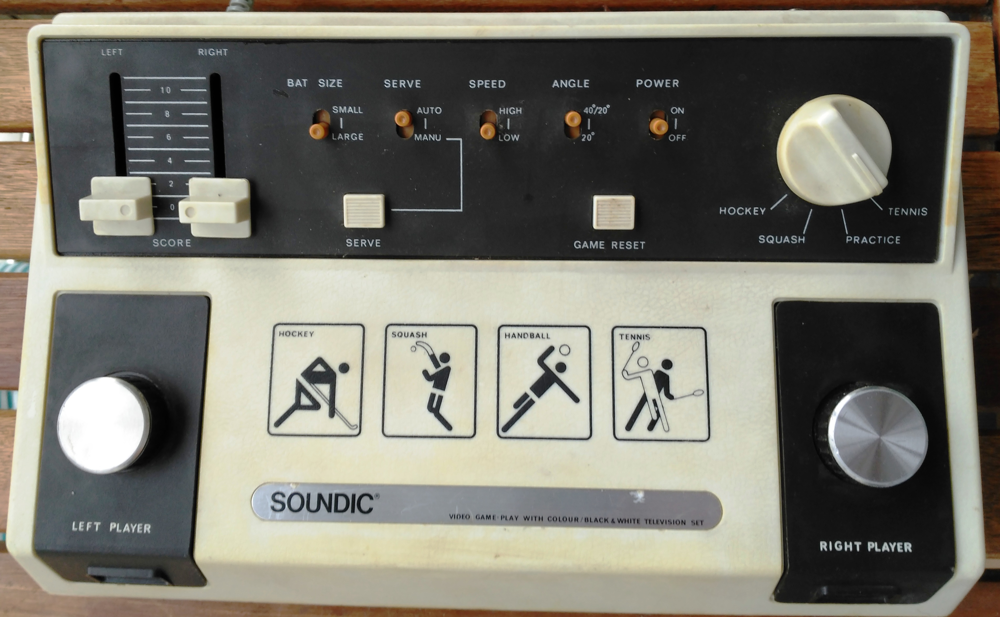
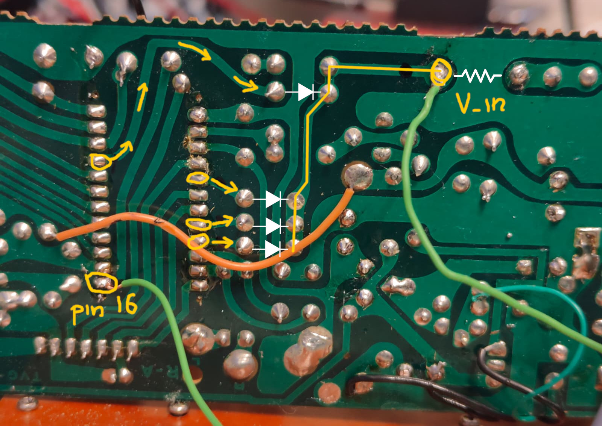

# Soundic TV Sports SD-01 Console (1977) [AY-3-8500] AV mod

This is AV mod for Soundic TV Sports SD-01 Console (1977) based on AY-3-8500, that gives good and stable signal.

You need to connect it to **pin 16 from AY-3-8500 chip and joined video signal on PCB**.
To find a joined video signal you need to look where **pins 6, 9, 10 and 24 are connected to diodes and then joined on the cathode side together** in one PCB trace – just **before 1K resistor**. Here is a photo of this:

After that you just need to **take +9V and GND** from anywhere you want on PCB **and connect it to AV mod**:

![Soundic SD-01 AV mod] (soundic-tv-game-ay-3-8500-av-mod.jpg "Soundic SD-01 AV composite mod")

This mod works much better than [Pong Clone AY-3-8500 Video-Hack 6 Feb. 2011](https://www.gruselroman-forum.de/cbmhardware/temp/ay-3-8500video.png). 
My approach was inspired by [exrom/rgbpong](https://github.com/exrom/rgbpong).
